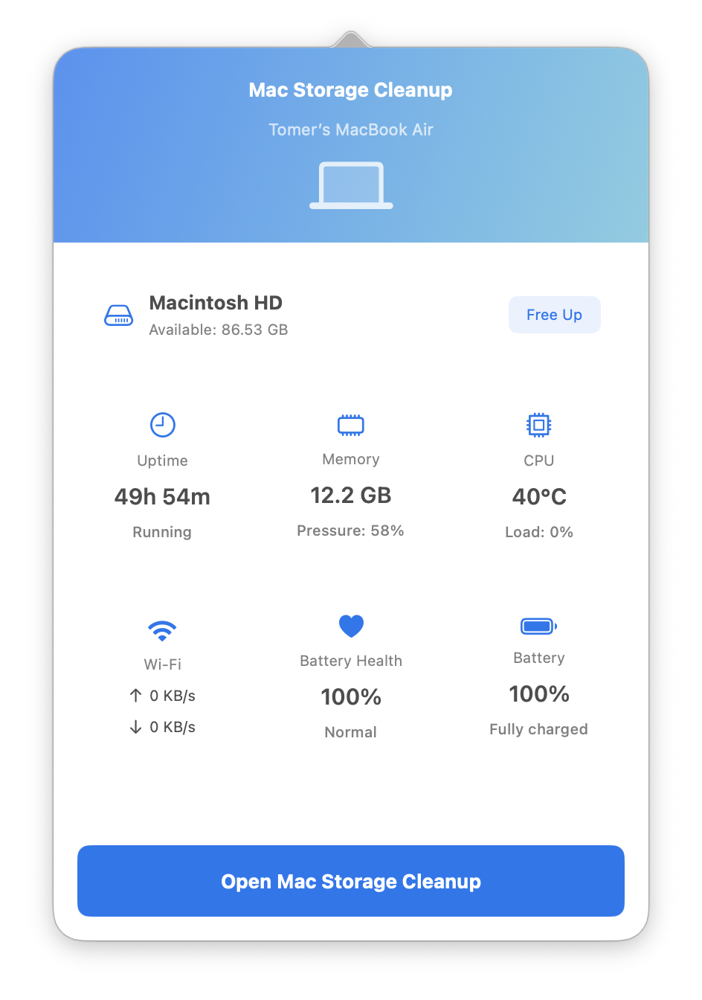
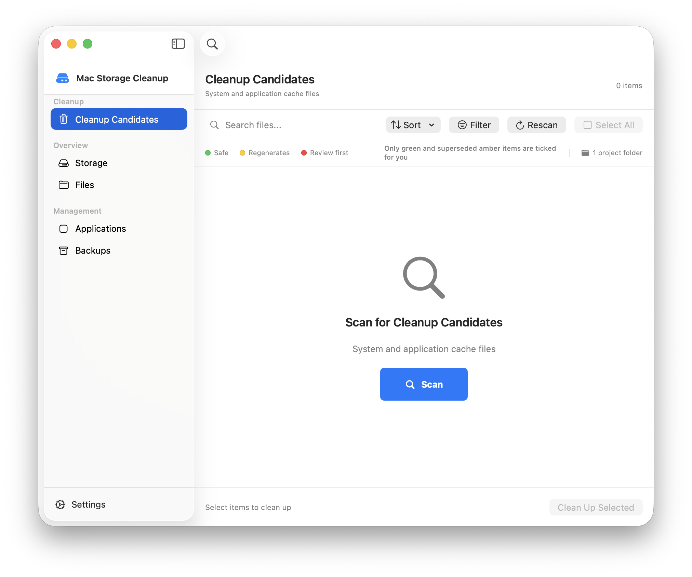
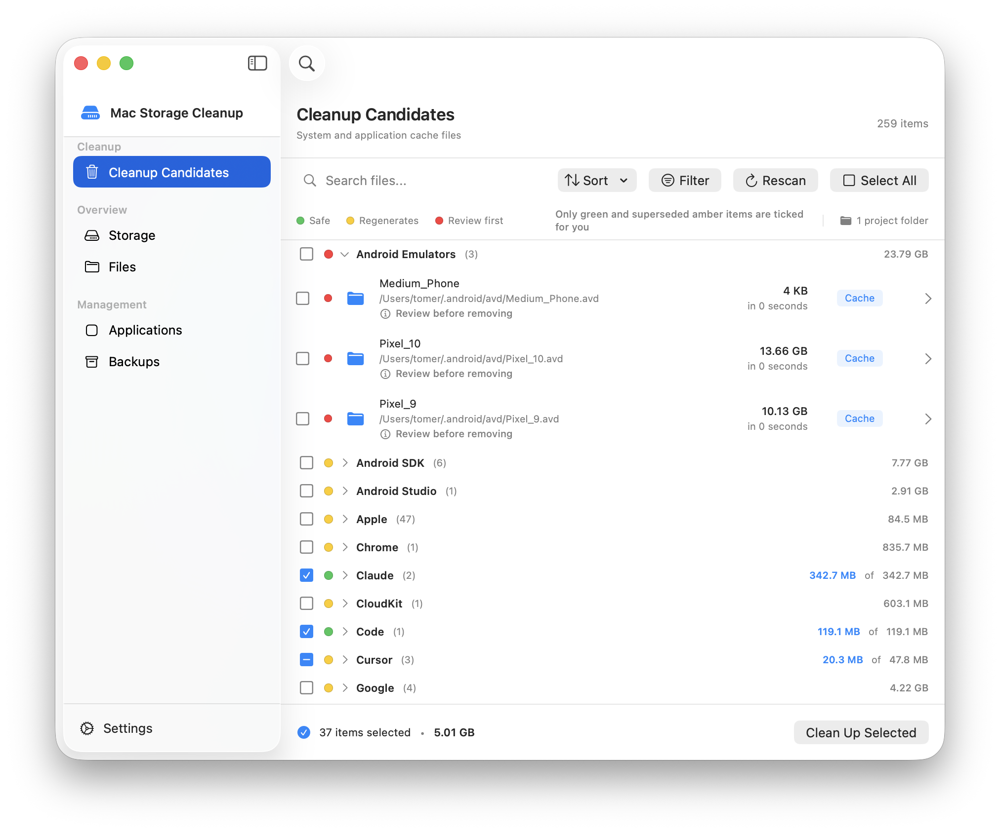
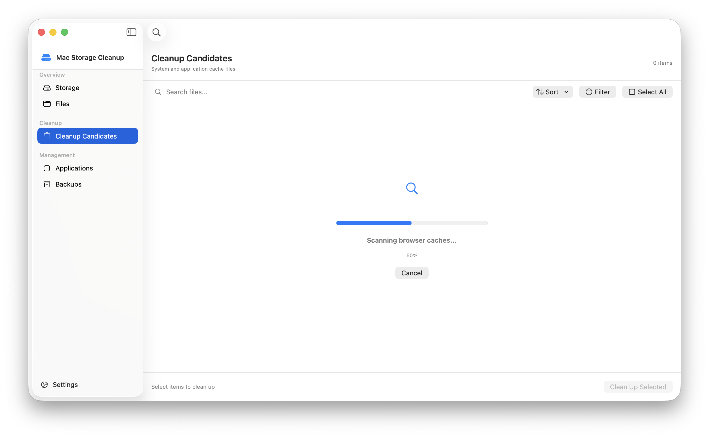

# Mac Storage Cleanup

<p align="center">
  
  
  
</p>

A powerful, native macOS application to clean up your Mac and free up storage space. Built with SwiftUI and designed with safety and user control in mind.

> ⚠️ **USE AT YOUR OWN RISK**: This application deletes files from your system. While it includes safety features and protections, always review what will be deleted before confirming. Some files, especially developer tools and simulator runtimes, can be large but may be needed for your work. The developers are not responsible for any data loss or system issues that may occur from using this application.

## ✨ Features

### 🧹 Comprehensive Cleanup
- **System & Application Caches** - Remove cached data from system and applications
- **Browser Caches** - Clean Safari, Chrome, Firefox, Edge, and Brave caches
- **Developer Tool Caches** - Clear Xcode, CocoaPods, npm, Gradle, and more
- **Xcode Simulators** - Delete iOS/iPadOS simulator devices and runtimes
  - Individual simulator devices with names (e.g., "iPhone 15 Pro - iOS 18.2")
  - Simulator runtime assets (uses `xcrun simctl runtime delete`)
  - DerivedData, Archives, and Device Support files
- **AI Agent Caches** - Remove caches from ChatGPT, Claude, Cursor, and other AI tools
- **Temporary Files** - Delete temporary files and logs
- **Large Files** - Find and manage files over 100MB
- **Old Files** - Identify files not accessed in over a year
- **Duplicate Files** - Detect identical copies across Documents, Desktop, Downloads, and Movies
- **Downloads Cleanup** - Review your Downloads folder grouped by type (documents, images, archives, installers)
- **Log Files** - Clear accumulated application and system logs

### 🛡️ Safety First
- **Safe List Protection** - Critical system files are automatically protected
- **Backup Support** - Optional backup before deletion
- **Move to Trash** - Files moved to Trash by default (recoverable)
- **Debug Mode** - Test cleanup operations without actually deleting files
- **Preview Before Cleanup** - Review exactly what will be deleted
- **Drill-Down Navigation** - Explore folder contents and select individual files
- **Show in Finder** - Right-click any item to reveal it in Finder
- **Vendor Grouping** - Cache candidates are collapsed into named groups (Google, Apple, JetBrains, Microsoft, Adobe, Mozilla, Dropbox, Slack, Zoom, Spotify) with item counts and group totals
- **"Other Caches" Bucket** - Small, unrecognized cache folders are collected into a single group instead of flooding the list
- **Overlap Detection** - Nested paths are suppressed so a tool's cache is not listed twice under two different groups

### 📊 Storage Analysis
- **Visual Storage Breakdown** - See what's taking up space with interactive pie chart
- **Category Analysis** - Detailed breakdown by file type
- **Real-time Scanning** - Live progress during storage analysis
- **Disk Space Indicator** - Bottom bar showing available space, updates after cleanup
- **File Browser** - Explore your filesystem with size information

### 📊 Menu Bar System Monitor
- **Always Accessible** - Status bar icon stays visible even when app is closed
- **Real-time System Stats** - Monitor your Mac's health at a glance
  - Storage: Available disk space with quick cleanup access
  - Memory: RAM usage and pressure percentage
  - CPU: Temperature and load percentage
  - Battery: Level, charging status, and health percentage
  - Uptime: System runtime since last restart
  - Network: Real-time upload/download speeds
- **Quick Actions** - Launch cleanup directly from menu bar
- **Auto-refresh** - Stats update every 2 seconds

### ⚙️ Advanced Features
- **Scheduled Cleanup** - Automatic cleanup on daily, weekly, or monthly basis
- **Customizable Thresholds** - Set your own definitions for "large" and "old" files; thresholds are read from preferences by both the scanner and the analyzer
- **Selective Cleanup** - Choose exactly what to clean
- **Application Management** - Uninstall apps with associated files
- **Backup Management** - Restore from previous cleanup backups

## 📸 Screenshots

### Menu Bar System Monitor

*Real-time system monitoring accessible from your menu bar*

### Main Window - Storage Analysis


### Cleanup Candidates


### Cleanup in Progress


## 🚀 Installation

### Requirements
- macOS 13.0 (Ventura) or later
- Xcode 15.0 or later (for building from source)

### Building from Source

1. Clone the repository:
```bash
git clone https://github.com/yourusername/MacCleaner.git
cd MacCleaner
```

2. Open the project in Xcode:
```bash
open MacStorageCleanupApp.xcodeproj
```

3. Build and run:
   - Select the `MacStorageCleanupApp` scheme
   - Press `Cmd + R` to build and run

### Download Pre-built Binary

*Check the [Releases](https://github.com/TomerGlick/MacCleaner/releases) page*

## 🔒 Permissions

The app requires the following permissions to function properly:

- **Full Disk Access** - Required to scan and clean cache directories
  - Go to System Settings > Privacy & Security > Full Disk Access
  - Add Mac Storage Cleanup to the list
  - The app will prompt you on first launch if this permission is not granted

Permission detection runs through a single shared probe (`FullDiskAccessDetector`) used by both app
startup and the permission re-check screen. It probes `~/Library/Safari`, `~/Library/Mail`, and
`~/Library/Messages`: a successful read means granted, an explicit permission error means denied, and
an inconclusive result (none of those directories present) lets the app start rather than blocking it
— individual operations then surface permission failures as they occur.

## ⚠️ Important Safety Information

**Please read carefully before using this application:**

### Risky Deletions

Some files that can be cleaned are **critical for certain workflows**:

- **Xcode Simulator Runtimes** - Deleting these will remove iOS/iPadOS simulators. You'll need to re-download them (several GB each) if you need them for development.
- **Xcode DerivedData** - Safe to delete but will cause longer build times on next Xcode build.
- **Developer Tool Caches** - May require re-downloading dependencies (npm, CocoaPods, etc.)
- **Browser Caches** - Will log you out of websites and require re-downloading cached content.

### Best Practices

1. **Use Debug Mode First** - Test what will be deleted without actually deleting
2. **Review Before Deleting** - Always check the preview before confirming
3. **Start Small** - Clean obvious caches first (browser, system caches)
4. **Backup Important Data** - Enable backup option for critical cleanups
5. **Know What You're Deleting** - Hover over items to see full paths and descriptions

### What's Protected

The app automatically protects:
- System files required for macOS to function
- User data (Photos, Mail, Messages, Contacts, etc.)
- Active applications
- Keychains and security files

### Disclaimer

This software is provided "as is" without warranty. The developers are not responsible for:
- Data loss from deleted files
- System instability
- Broken development environments
- Lost work or productivity

**Always maintain regular backups of your important data.**

## 💡 Usage

### Menu Bar Monitor

The app includes a convenient menu bar monitor that stays accessible even when the main window is closed:

1. **Access System Stats** - Click the menu bar icon to view real-time system information
2. **Quick Cleanup** - Click "Free Up" next to storage to launch cleanup
3. **Open Main App** - Click "Open Mac Storage Cleanup" to show the main window
4. **Always Running** - The app continues monitoring in the background

To enable/disable the menu bar icon:
1. Open Preferences (gear icon)
2. Go to the "General" tab
3. Toggle "Show menu bar icon"

### Quick Start

1. **Launch the app** and grant Full Disk Access permission when prompted
2. **Scan Your Mac** - Press **Start Scan** (the scan can be cancelled while it runs)
3. **Review Results** - Browse cleanup candidates by category; cache results arrive grouped by vendor,
   with the first group expanded and each header showing item count and total size
4. **Select Items** - Choose what you want to clean (or drill down into folders)
5. **Clean Up** - Click "Clean Up Selected" and confirm

### Debug Mode

For testing without actually deleting files:

1. Open Preferences (gear icon)
2. Go to the "Cleanup" tab
3. Enable "Debug Mode (simulate deletions)"
4. All cleanup operations will be simulated

### Drill-Down Navigation

1. Click the arrow (›) next to any folder to see its contents
2. Select individual files or subdirectories
3. Use "Show in Finder" (right-click) to locate files
4. Delete selected items directly from the detail view

### Scheduled Cleanup

1. Open Preferences
2. Go to the "Scheduled" tab
3. Enable scheduled cleanup
4. Choose frequency and categories
5. The app will automatically clean safe categories

## 🏗️ Architecture

The project is organized into two main components:

### MacStorageCleanup (Core Library)
- **FileScanner** - Scans filesystem for cleanup candidates
- **CacheManager** - Manages cache discovery and cleanup
- **CleanupEngine** - Handles safe file deletion with rollback
- **CleanupCategorizer** - Single shared source of categorization rules, used by both the scanner and
  the storage analyzer so the two can never disagree about what a file is
- **SafeListManager** - Protects critical system files
- **BackupManager** - Creates and manages backups
- **ApplicationManager** - Discovers and uninstalls applications
- **PreferencesStore** - One persistence path for all settings, including migration of legacy
  standalone `UserDefaults` keys

### MacStorageCleanupApp (UI)
- **SwiftUI Views** - Modern, native macOS interface
- **ViewModels** - MVVM architecture for clean separation
- **StorageAnalysisService** - Owns storage analysis passes, with cancellation kept separate from
  cleanup scans so stopping one does not abort the other
- **StorageInspectionService** - Directory sizing and detail loading, with session-scoped caching to
  avoid repeated walks over the same tree
- **Services** - Structured logging, notifications, preferences, menu bar, and coordination

## 🧪 Testing

The project includes comprehensive unit tests:

```bash
# Run the core library test suite
cd MacStorageCleanup && swift test

# Build the core library
cd MacStorageCleanup && swift build

# Run app tests through Xcode
xcodebuild test -scheme MacStorageCleanupApp
```

Categorization edge cases are covered in `CleanupCategorizerTests` — case-insensitive browser cache
detection, Application Support temporary paths, deterministic age thresholds, and protected/app-bundle
exclusions from old-file sweeps.

## 🤝 Contributing

Contributions are welcome! Please feel free to submit a Pull Request.

1. Fork the repository
2. Create your feature branch (`git checkout -b feature/AmazingFeature`)
3. Commit your changes (`git commit -m 'Add some AmazingFeature'`)
4. Push to the branch (`git push origin feature/AmazingFeature`)
5. Open a Pull Request

### Development Guidelines

- Follow Swift style guidelines
- Add unit tests for new features
- Update documentation as needed
- Test on multiple macOS versions if possible

## 📝 License

This project is licensed under the BSD 3-Clause License - see the [LICENSE](LICENSE) file for details.

## 🙏 Acknowledgments

- Built with SwiftUI and modern macOS APIs
- Inspired by the need for a safe, transparent Mac cleanup tool
- Thanks to the Swift community for excellent tools and libraries

## 📧 Contact

- GitHub Issues: [Report a bug or request a feature](https://github.com/yourusername/MacCleaner/issues)

## 🗺️ Roadmap

- [x] Menu bar system monitor with real-time stats
- [x] Duplicate file finder
- [x] Download folder cleanup
- [x] Shared categorization rules between scanner and analyzer
- [x] Unified preference persistence with legacy key migration
- [x] Structured logging in place of `print` debugging
- [ ] Smart recommendations based on usage patterns
- [ ] Export cleanup reports
- [ ] Localization support
- [ ] Launch at login option (control is present but disabled until wired up)

---

Made with ❤️ for the macOS community
